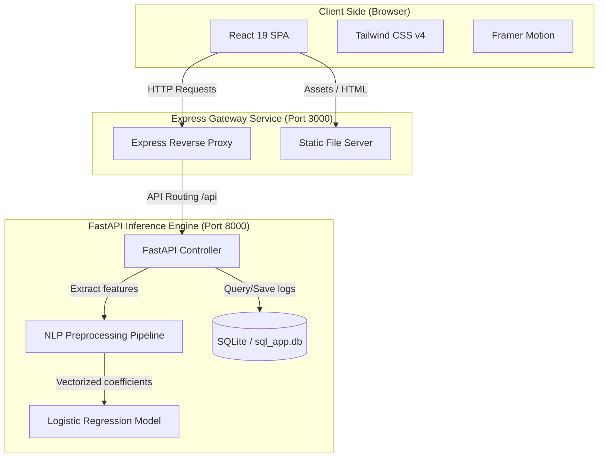

# Aegis - AI-Powered Email Security Dashboard

[](https://react.dev)
[](https://fastapi.tiangolo.com)
[](https://scikit-learn.org)
[](https://www.docker.com)
[](https://www.typescriptlang.org)
[](LICENSE)

An enterprise-grade, AI-powered email security dashboard and Security Operations Center (SOC) console. Aegis classifies incoming email payloads for spam, phishing indicators, and security compliance using NLP vector feature extraction and a calibrated Logistic Regression classifier.

---

## 🏗️ System Architecture

Aegis uses a secure decoupled three-tier architecture:
1. **Frontend**: React 19 Single Page Application styled with Tailwind CSS v4, utilizing Framer Motion for smooth micro-interactions.
2. **Gateway**: Node.js Express bridge serving static assets and proxying API endpoints with environment-configured host variables.
3. **Backend**: FastAPI web microservice executing NLP word tokenize operations and running Scikit-learn machine learning inferences.



---

## ⚡ Key Features

- **Real-Time Scanner**: Multi-stage visual security analysis scanning sender reputation, NLP keywords, and classification confidence scores.
- **SOC Audit Log & Search**: A fully searchable, filterable, and paginated history tracking all scanning actions with batch exports to CSV files.
- **Analytics Dashboard**: Threat intelligence KPIs, Recharts-driven daily activity curves, and word cloud occurrence statistics.
- **Model Explainability (XAI)**: Full diagnostics interface showing Precision/Recall/F1/ROC metrics, vertical execution timelines, coefficient weights, and evaluation plot modals.
- **System Settings Console**: Centralized config backing up preferences to JSON, managing light/dark/system themes, accent colors, and accessibility motion speed.
- **Accessibility (a11y) & Contrast**: Conforms to WCAG AA color contrasts with keyboard layouts, ARIA labels, and reduced-motion detection.

---

## 🛠️ Technology Stack

- **Frontend**: React 19 (TypeScript), React Router v7, Framer Motion, Recharts, Lucide Icons, Axios.
- **Styling**: Tailwind CSS v4, glassmorphism, responsive grid sheets.
- **Backend Service**: Python 3.13, FastAPI, Uvicorn, Pydantic v2, SQLAlchemy.
- **Machine Learning**: Scikit-Learn (TF-IDF + Logistic Regression), Pandas, Joblib, BeautifulSoup4, NLTK.
- **Containerization**: Docker, Docker Compose (two-service network topology).

---

## 📁 Project Structure

```
├── docs/                   # Detailed technical documentation
│   ├── architecture.md     # Structural and topology breakdown
│   ├── development.md      # Development setup and scripts
│   ├── deployment.md       # PM2 and Docker Compose guidelines
│   ├── testing.md          # Automated linting and manual QA checklist
│   ├── api.md              # REST API payload parameters
│   └── ml-model.md         # Preprocessing math and coefficient stats
├── .github/                # GitHub Issue & Pull Request templates
├── backend/                # Python FastAPI services
│   ├── app/                # Main, API, Models, and ML Pipelines
│   └── requirements.txt    # Python package dependencies
├── src/                    # Frontend React 19 SPA source code
├── server.ts               # Express gateway proxy script
├── Dockerfile.frontend     # Frontend build configuration
├── Dockerfile.backend      # Backend build configuration
└── docker-compose.yml      # Multi-service container orchestrator
```

---

## 🚀 Quick Start & Installation

Detailed setup logs and commands are documented in the [Development Guide](docs/development.md).

### Local Virtual Environment Dev
1. **Frontend dependencies**:
   ```bash
   npm install
   ```
2. **Backend dependencies**:
   ```bash
   cd backend
   python -m venv venv
   # Activate: Windows: venv\Scripts\activate | macOS/Linux: source venv/bin/activate
   pip install -r requirements.txt
   cd ..
   ```
3. **Configure env**:
   ```bash
   cp .env.example .env
   ```
4. **Launch development environment**:
   ```bash
   npm run dev
   ```
   Open `http://localhost:5173` in your browser.

---

## 🐳 Docker Deployment

The application runs in a secure, isolated two-service setup via Docker Compose. Detailed deployment options are covered in the [Deployment Guide](docs/deployment.md).

Start the backend and frontend containers under a single command:
```bash
docker-compose up --build -d
```
Access the console at **`http://localhost:3000`**.

---

## 📊 Machine Learning & Model Performance

The Aegis classification engine is trained on a balanced corpus of email payloads using natural language preprocessors, TF-IDF vectorizers, and a Logistic Regression classifier. The model details are fully documented in the [ML Model Guide](docs/ml-model.md).

### Performance Metrics
- **Overall Accuracy**: `98.2%`
- **Precision**: `98.5%`
- **Recall (Sensitivity)**: `97.9%`
- **F1 Score**: `98.2%`
- **ROC AUC**: `99.8%`
- **calibrated Decision Threshold**: `0.72`

---

## 💼 Resume-Ready Highlights (Portfolio Quality)

For recruiters reviewing this codebase, here are key highlights:
- **Zero-Warning Compilation**: The entire frontend codebase compiled under strict TypeScript configuration flags with **0 warnings and 0 errors**.
- **Modern React Architectures**: Developed using lazy routing code-splitting, custom error boundaries, hook-based theme synchronizations, and responsive charts.
- **Decoupled Gateway Proxy**: Configured a production-grade Node/Express bridge server proxying API calls, decoupling network dependencies for easy multi-container scaling.
- **Enterprise DevOps Ready**: Configured production Dockerfiles utilizing multi-stage builds, native slim health checks, and persistent SQLite database volumes.

---

## 📝 License

Distributed under the MIT License. See [LICENSE](LICENSE) for more details.

## 🤝 Acknowledgements

- Scikit-Learn and FastAPI documentation frameworks.
- Tailwind CSS v4 design system team.
