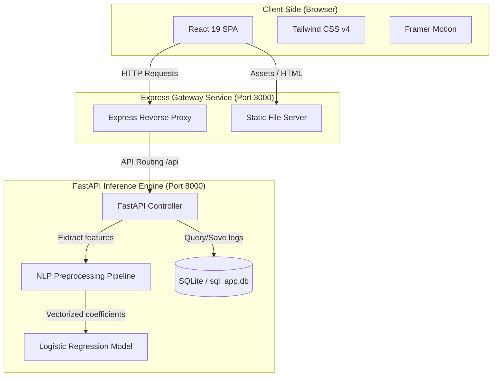

# Aegis System Architecture

This document details the software architecture, communications flow, and structural design of the Aegis Email Security Console.

## Structural Overview

Aegis is built as a modular enterprise application combining a fast React client, a secure Node.js Express Gateway, and a microservice-based Python FastAPI backend that serves the machine learning inference pipeline.

### Topology Flow Diagram

## Architectural Components

### 1. Frontend Client Layer
- **Framework**: React 19 Single Page Application.
- **Routing**: Client-side routing with `react-router-dom` using `React.lazy` and `Suspense` for asynchronous code-splitting.
- **Styling**: Tailwind CSS v4 featuring premium glassmorphic visual aesthetics, dark mode by default, and color contrast ratios conforming to WCAG AA guidelines.
- **Animation**: Micro-interactions managed via `framer-motion` with configurations checking user preferences for `reduced-motion`.

### 2. Gateway / Bridge Server Layer
- **Runtime**: Node.js Express Server.
- **Role**:
  - In development: Proxies `/api` requests to `http://localhost:8000` via Vite development server proxy.
  - In production: Express serves static assets from `dist/` and runs a high-performance reverse proxy forwarding `/api` requests to the configured `BACKEND_URL` (typically the `backend` container at `http://backend:8000`).
  - Child Process Spawning: Automatically detects environment and spawns FastAPI backend as a child process during local dev, simplifying running under a single command.

### 3. Backend Machine Learning Layer
- **Framework**: Python 3.13 FastAPI.
- **Database**: SQLite (managed with SQLAlchemy) storing training datasets and query metadata logs locally.
- **NLP Pipeline**: Raw emails are parsed (BeautifulSoup4 for HTML cleaning, NLTK-driven lemmatization, and regex word tokenizer).
- **Inference Model**: Scikit-learn TF-IDF Vectorizer and calibrated Logistic Regression classifier.
